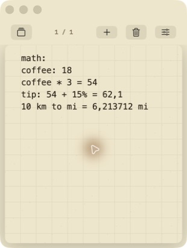

# AntiScratch

<p align="center">
  
</p>

<p align="center">
  Um bloco de notas pequeno e nativo para macOS — sempre a um atalho de distância.
</p>

O AntiScratch é um espaço feito para registrar ideias, cálculos rápidos, listas e temporizadores usando o teclado. Desenvolvido inteiramente em SwiftUI, ele mantém as notas no seu Mac e fica escondido até você pressionar <kbd>⌥ A</kbd>.

## Destaques

- App nativo para macOS com janela compacta e tamanho fixo
- Atalho global <kbd>⌥ A</kbd> e acesso pela barra de menus
- Deslize horizontal entre as notas, sempre na ordem
- Salvamento local automático — sem conta e sem nuvem
- Cálculos no texto, variáveis, porcentagens e conversões de unidades
- Listas, somas, médias, contadores e temporizadores
- Temas Hortelã, Berinjela e Papel
- Ícone do Dock opcional

## Modos inteligentes

Comece a primeira linha com um comando seguido de `:`.

```text
math:
preço: 120
preço + 15% = 138
10 km to mi = 6.213712 mi
```

| Comando | O que faz |
| --- | --- |
| `math:` | Calcula expressões depois de `=` e aceita variáveis, porcentagens e conversões |
| `list:` | Enter cria uma caixa de seleção; apagar um item vazio remove a caixa |
| `sum:` | Soma todos os números da nota |
| `avg:` | Mostra a média de todos os números |
| `count:` | Conta linhas, palavras e caracteres |
| `timer: 5m` | Inicia uma contagem regressiva; `timer:` sem duração funciona como cronômetro |

Linhas iniciadas com `//` são ignoradas pelos modos de cálculo agregado.

## Instalação

1. Baixe `AntiScratch-1.0.0.dmg` na [versão mais recente](../../releases/latest).
2. Arraste o AntiScratch para a pasta Aplicativos.
3. Na primeira abertura, clique com o botão direito no app e escolha **Abrir**. A versão pública possui assinatura ad hoc e ainda não foi notarizada pela Apple.

Requer macOS 14 Sonoma ou mais recente.

## Compilar o projeto

```bash
git clone https://github.com/Yago-Vanzan/AntiScratch.git
cd AntiScratch
open AntiScratch.xcodeproj
```

Para criar o mesmo DMG distribuível:

```bash
./scripts/build-dmg.sh
```

O arquivo será criado em `dist/AntiScratch-1.0.0.dmg`.

Para rodar os testes do motor de notas:

```bash
swift test
```

## Privacidade

As notas são codificadas e armazenadas no contêiner local `UserDefaults` do app. O AntiScratch não possui análises de uso, sistema de contas ou código de rede.

## Estado do projeto

Este é um projeto independente e de código aberto, inspirado na agilidade dos blocos de notas descartáveis. Não possui vínculo com o AntiNote nem com seus desenvolvedores.

## Licença

MIT © Yago Vanzan
